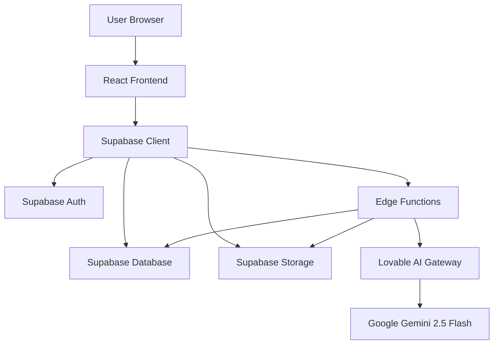
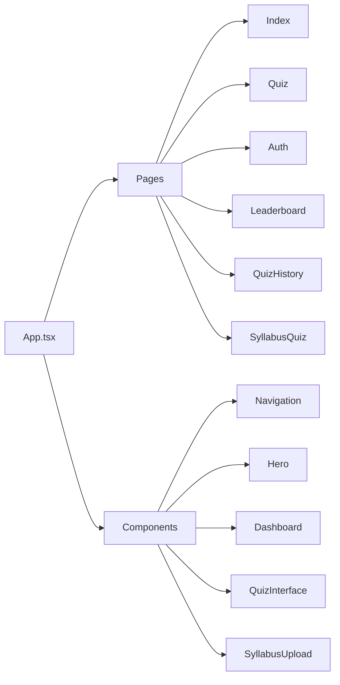
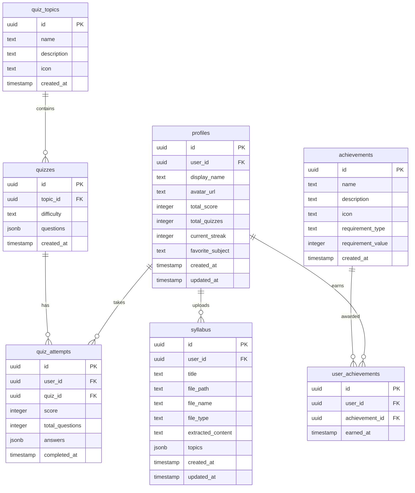
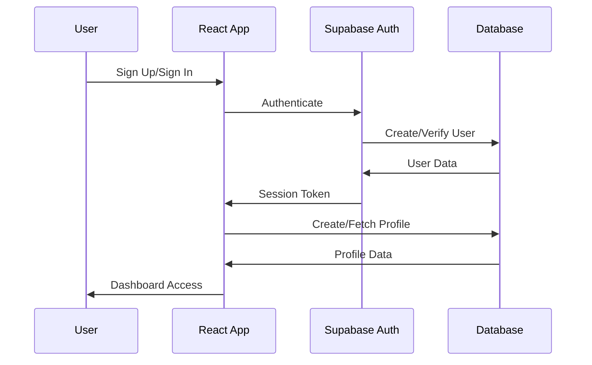
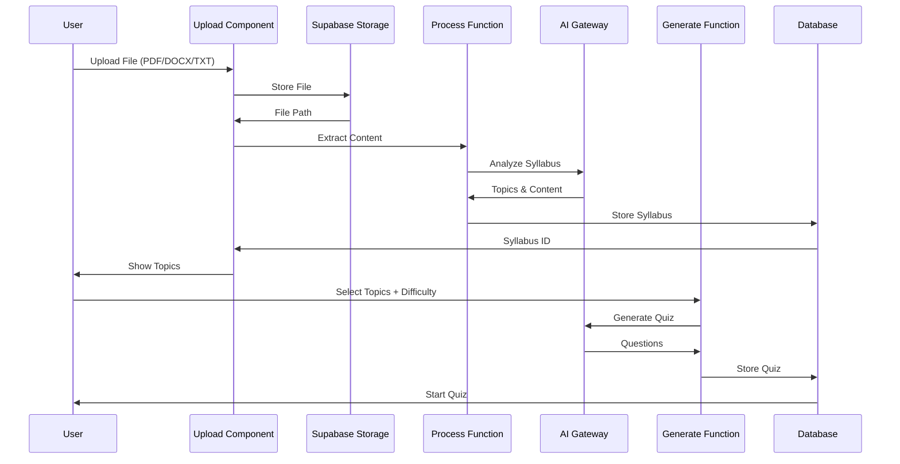
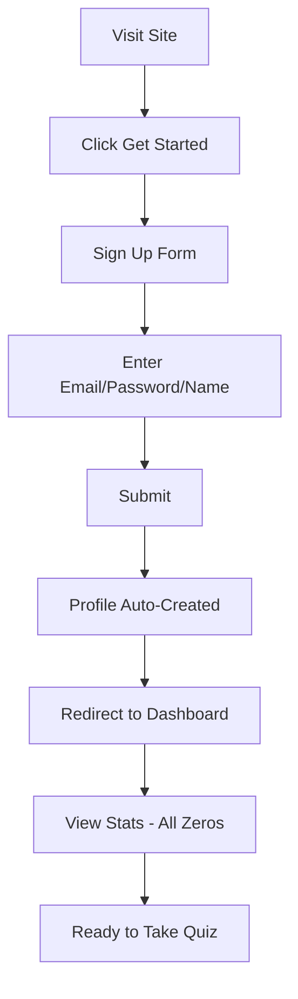
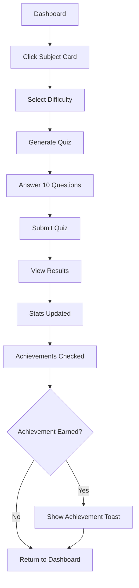
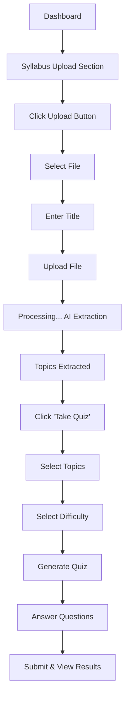
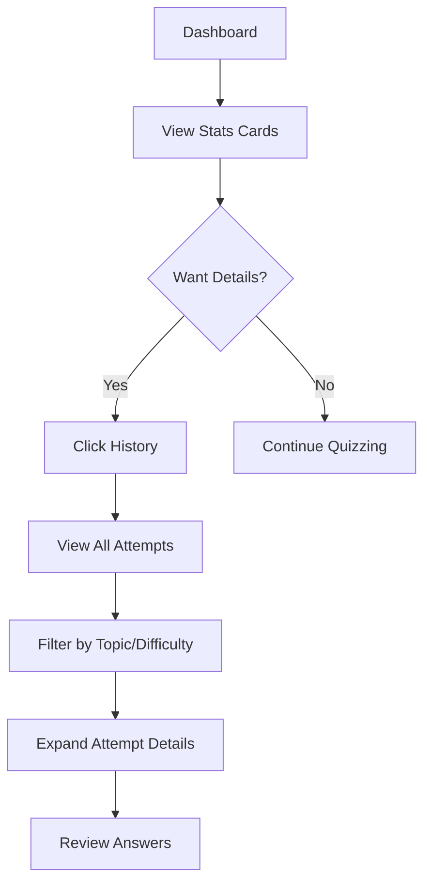
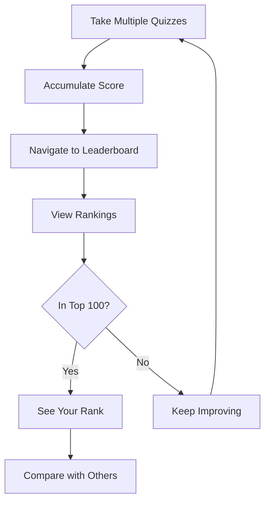

# AI Shinobi - Project Documentation

## Table of Contents
1. [Project Overview](#project-overview)
2. [Architecture & Tech Stack](#architecture--tech-stack)
3. [Features Documentation](#features-documentation)
4. [Database Schema](#database-schema)
5. [API Documentation](#api-documentation)
6. [Component Structure](#component-structure)
7. [Setup & Installation](#setup--installation)
8. [User Workflows](#user-workflows)
9. [Future Enhancements](#future-enhancements)
10. [Troubleshooting Guide](#troubleshooting-guide)

---

## Project Overview

**AI Shinobi** is an intelligent quiz application that leverages AI to generate personalized quizzes based on various topics or user-uploaded syllabi. The platform tracks user progress, awards achievements, and maintains a competitive leaderboard.

### Key Features
- 🤖 AI-powered quiz generation using Lovable AI (Google Gemini models)
- 📚 Syllabus upload and processing for custom quizzes
- 📊 Progress tracking with detailed analytics
- 🏆 Achievement system with milestone-based rewards
- 🎯 Difficulty levels (Easy, Medium, Hard)
- 📈 Real-time leaderboard
- 🔐 Secure authentication system
- 📱 Fully responsive design

### Technology Stack
- **Frontend**: React 18, TypeScript, Vite
- **Styling**: Tailwind CSS, shadcn/ui components
- **Backend**: Supabase (PostgreSQL, Edge Functions)
- **AI Integration**: Lovable AI Gateway (Google Gemini 2.5 Flash)
- **Authentication**: Supabase Auth
- **Storage**: Supabase Storage
- **State Management**: React Hooks, TanStack Query
- **Routing**: React Router DOM v6

---

## Architecture & Tech Stack

### System Architecture



### Frontend Architecture



### Database Schema Diagram



### Authentication Flow



---

## Features Documentation

### 1. User Authentication

**Implementation**: `src/hooks/useAuth.tsx`, `src/pages/Auth.tsx`

- Email/password authentication
- Automatic profile creation on sign-up
- Persistent sessions using localStorage
- Protected routes with auth state management

**Key Functions**:
```typescript
- signUp(email, password, displayName)
- signIn(email, password)
- signOut()
```

### 2. Quiz Generation System

**Implementation**: 
- Edge Function: `supabase/functions/generate-quiz/index.ts`
- Component: `src/components/QuizInterface.tsx`

**Flow**:
1. User selects topic and difficulty
2. Frontend calls `generate-quiz` edge function
3. Edge function queries Lovable AI Gateway with structured prompt
4. AI generates 10 multiple-choice questions
5. Questions stored in database with topic reference
6. Quiz rendered to user with timer

**Question Format**:
```typescript
{
  question: string;
  options: string[];
  correctAnswer: number; // index of correct option
}
```

### 3. Syllabus Upload & Processing

**Implementation**:
- Upload Component: `src/components/SyllabusUpload.tsx`
- Quiz Page: `src/pages/SyllabusQuiz.tsx`
- Edge Functions: 
  - `supabase/functions/process-syllabus/index.ts`
  - `supabase/functions/generate-syllabus-quiz/index.ts`

**Flow**:


**Supported File Types**:
- PDF (.pdf)
- Word Documents (.docx, .doc)
- Text Files (.txt)
- Maximum file size: 10MB

### 4. Progress Tracking & Analytics

**Implementation**: `src/components/Dashboard.tsx`

**Tracked Metrics**:
- Total quizzes completed
- Total score accumulated
- Current streak (consecutive days)
- Average score percentage
- Favorite subject (most quizzed topic)

**Database Triggers**:
- `update_user_stats_after_quiz()`: Updates profile stats after each quiz
- `check_achievements()`: Awards achievements based on milestones

### 5. Achievement System

**Implementation**: Database trigger `check_achievements()`

**Achievement Types**:
- **Quizzes Completed**: Milestones at 1, 10, 50, 100 quizzes
- **Total Score**: Score milestones at 100, 500, 1000 points
- **Streak**: Consecutive day milestones at 3, 7, 30 days
- **Perfect Scores**: Perfect quiz milestones at 1, 5, 10 perfects

**Award Logic**:
```sql
-- Automatically triggered after each quiz attempt
-- Checks if user meets any achievement requirements
-- Awards achievements that haven't been earned yet
```

### 6. Leaderboard System

**Implementation**: `src/pages/Leaderboard.tsx`

**Rankings Based On**:
- Total score (primary)
- Total quizzes completed (secondary)
- Current streak (tertiary)

**Features**:
- Top 100 users displayed
- Real-time ranking updates
- User's own rank highlighted
- Avatar and display name shown

### 7. Quiz History

**Implementation**: `src/pages/QuizHistory.tsx`

**Displays**:
- All past quiz attempts
- Score and total questions
- Topic and difficulty
- Completion date
- Detailed answers view

---

## Database Schema

### Tables Overview

#### `profiles`
Stores user profile information and statistics.

| Column | Type | Description |
|--------|------|-------------|
| id | uuid | Primary key |
| user_id | uuid | References auth.users |
| display_name | text | User's display name |
| avatar_url | text | Profile picture URL |
| total_score | integer | Cumulative score |
| total_quizzes | integer | Number of quizzes taken |
| current_streak | integer | Consecutive days streak |
| favorite_subject | text | Most quizzed topic |
| created_at | timestamp | Account creation |
| updated_at | timestamp | Last update |

**RLS Policies**:
- Users can view, create, and update their own profile
- Users cannot delete profiles

#### `quiz_topics`
Predefined quiz topics/subjects.

| Column | Type | Description |
|--------|------|-------------|
| id | uuid | Primary key |
| name | text | Topic name |
| description | text | Topic description |
| icon | text | Icon identifier |
| created_at | timestamp | Creation date |

**RLS Policies**:
- Anyone can view quiz topics (public read)
- No insert/update/delete permissions for users

#### `quizzes`
Generated quiz questions.

| Column | Type | Description |
|--------|------|-------------|
| id | uuid | Primary key |
| topic_id | uuid | References quiz_topics |
| difficulty | text | Easy/Medium/Hard |
| questions | jsonb | Array of question objects |
| created_at | timestamp | Generation date |

**RLS Policies**:
- Anyone can view quizzes (public read)
- No insert/update/delete permissions for users

#### `quiz_attempts`
User quiz completion records.

| Column | Type | Description |
|--------|------|-------------|
| id | uuid | Primary key |
| user_id | uuid | References auth.users |
| quiz_id | uuid | References quizzes |
| score | integer | Points earned |
| total_questions | integer | Number of questions |
| answers | jsonb | User's answer selections |
| completed_at | timestamp | Completion time |

**RLS Policies**:
- Users can view and create their own attempts
- No update/delete permissions

#### `achievements`
Achievement definitions.

| Column | Type | Description |
|--------|------|-------------|
| id | uuid | Primary key |
| name | text | Achievement name |
| description | text | Achievement description |
| icon | text | Icon identifier |
| requirement_type | text | Type of requirement |
| requirement_value | integer | Threshold value |
| created_at | timestamp | Creation date |

**RLS Policies**:
- Anyone can view achievements (public read)
- No insert/update/delete permissions for users

#### `user_achievements`
User-earned achievements.

| Column | Type | Description |
|--------|------|-------------|
| id | uuid | Primary key |
| user_id | uuid | References auth.users |
| achievement_id | uuid | References achievements |
| earned_at | timestamp | Award date |

**RLS Policies**:
- Users can view and create their own achievements
- No update/delete permissions

#### `syllabus`
User-uploaded syllabus files and extracted content.

| Column | Type | Description |
|--------|------|-------------|
| id | uuid | Primary key |
| user_id | uuid | References auth.users |
| title | text | Syllabus title |
| file_path | text | Storage path |
| file_name | text | Original filename |
| file_type | text | File extension |
| extracted_content | text | AI-extracted text |
| topics | jsonb | Extracted topics array |
| created_at | timestamp | Upload date |
| updated_at | timestamp | Last update |

**RLS Policies**:
- Users can view, create, update, and delete their own syllabus
- Full CRUD permissions for own data

### Database Functions

#### `update_updated_at_column()`
Trigger function to automatically update `updated_at` timestamp.

#### `handle_new_user()`
Trigger function to create profile when new user signs up.

#### `update_user_stats_after_quiz()`
Trigger function to update user statistics after quiz completion.

#### `check_achievements()`
Trigger function to award achievements based on user progress.

### Storage Buckets

#### `syllabus-files`
- **Purpose**: Store user-uploaded syllabus files
- **Public**: No (private)
- **Max File Size**: 10MB
- **Allowed Types**: PDF, DOCX, DOC, TXT
- **RLS Policies**:
  - Users can upload files to their own folder
  - Users can view their own files
  - Users can delete their own files

---

## API Documentation

### Edge Functions

All edge functions are deployed at:
```
https://aihgcdxhweaeoergilyz.supabase.co/functions/v1/{function-name}
```

#### 1. `generate-quiz`

**Purpose**: Generate AI-powered quiz questions for a topic.

**Endpoint**: `POST /functions/v1/generate-quiz`

**Authentication**: Required (JWT)

**Request Body**:
```typescript
{
  topic: string;      // Quiz topic name
  difficulty: string; // "easy" | "medium" | "hard"
}
```

**Response**:
```typescript
{
  quiz: {
    id: string;
    topic_id: string;
    difficulty: string;
    questions: Array<{
      question: string;
      options: string[];
      correctAnswer: number;
    }>;
    created_at: string;
  }
}
```

**Error Responses**:
- `400`: Missing topic or difficulty
- `429`: Rate limit exceeded
- `402`: AI credits exhausted
- `500`: Server error

**Implementation Details**:
- Uses Lovable AI Gateway with Google Gemini 2.5 Flash
- Generates exactly 10 multiple-choice questions
- Creates or finds matching quiz topic
- Stores quiz in database for reuse

#### 2. `process-syllabus`

**Purpose**: Extract content and topics from uploaded syllabus files.

**Endpoint**: `POST /functions/v1/process-syllabus`

**Authentication**: Required (JWT)

**Request Body**:
```typescript
{
  syllabusId: string; // UUID of syllabus record
  filePath: string;   // Storage path to file
}
```

**Response**:
```typescript
{
  success: true;
  syllabusId: string;
  topics: string[];
  extractedContent: string;
}
```

**Error Responses**:
- `400`: Missing syllabusId or filePath
- `404`: File not found
- `429`: Rate limit exceeded
- `500`: Processing error

**Implementation Details**:
- Downloads file from Supabase Storage
- Extracts text content (format-specific parsing)
- Uses AI to identify main topics (5-10 topics)
- Updates syllabus record with extracted data

#### 3. `generate-syllabus-quiz`

**Purpose**: Generate quiz questions from syllabus content.

**Endpoint**: `POST /functions/v1/generate-syllabus-quiz`

**Authentication**: Required (JWT)

**Request Body**:
```typescript
{
  syllabusId: string;  // UUID of syllabus
  topics: string[];    // Selected topics
  difficulty: string;  // "easy" | "medium" | "hard"
  context: string;     // Extracted syllabus content
}
```

**Response**:
```typescript
{
  quiz: {
    id: string;
    topic_id: string;
    difficulty: string;
    questions: Array<{
      question: string;
      options: string[];
      correctAnswer: number;
    }>;
    created_at: string;
  }
}
```

**Error Responses**:
- `400`: Missing required parameters
- `429`: Rate limit exceeded
- `402`: AI credits exhausted
- `500`: Generation error

**Implementation Details**:
- Uses syllabus content as context for AI
- Focuses on selected topics
- Generates topic-specific questions
- Creates quiz topic with syllabus topics

---

## Component Structure

### Page Components

#### `src/pages/Index.tsx`
Main landing page combining multiple sections.

**Renders**:
- Navigation
- Hero section
- Syllabus upload
- Subject grid
- Dashboard (if authenticated)

#### `src/pages/Auth.tsx`
Authentication page with sign-in/sign-up forms.

**Features**:
- Email/password authentication
- Display name input for sign-up
- Form validation
- Error handling
- Redirect after successful auth

#### `src/pages/Quiz.tsx`
Quiz taking interface for standard topics.

**Flow**:
1. Select topic from grid
2. Select difficulty level
3. Generate or load quiz
4. Take quiz with timer
5. View results and share

#### `src/pages/SyllabusQuiz.tsx`
Quiz interface for syllabus-based quizzes.

**Features**:
- Display syllabus title
- Show extracted topics
- Multi-select topic checkboxes
- Difficulty selection
- Generate quiz button

#### `src/pages/QuizHistory.tsx`
Display user's past quiz attempts.

**Features**:
- Filterable by topic/difficulty
- Sortable by date/score
- Expandable answer details
- Pagination

#### `src/pages/Leaderboard.tsx`
Global user rankings.

**Features**:
- Top 100 users
- Real-time updates
- User highlight
- Score/streak/quiz count display

#### `src/pages/NotFound.tsx`
404 error page for invalid routes.

### UI Components

#### `src/components/Navigation.tsx`
Persistent header navigation.

**Features**:
- Logo and branding
- Navigation links
- Auth status display
- Sign in/out buttons

#### `src/components/Hero.tsx`
Landing page hero section.

**Content**:
- Main headline
- Value proposition
- CTA buttons
- Background styling

#### `src/components/SubjectGrid.tsx`
Grid of available quiz topics.

**Features**:
- Topic cards with icons
- Hover effects
- Click to start quiz
- Responsive grid layout

#### `src/components/Dashboard.tsx`
User statistics dashboard.

**Displays**:
- Total quizzes
- Total score
- Current streak
- Average score
- Recent achievements
- Quick stats cards

#### `src/components/QuizInterface.tsx`
Quiz question display and interaction.

**Features**:
- Question progression
- Timer countdown
- Option selection
- Submit handling
- Results display
- Score calculation

#### `src/components/SyllabusUpload.tsx`
File upload interface for syllabi.

**Features**:
- Drag-and-drop upload
- File type validation
- Size limit checking
- Upload progress
- File list display
- Delete functionality

#### `src/components/ShareScore.tsx`
Social sharing component for quiz results.

**Features**:
- Share to social media
- Copy link functionality
- Custom share messages

#### `src/components/SubtopicSelection.tsx`
Modal for selecting quiz subtopics.

**Features**:
- Dialog interface
- Subtopic buttons
- Navigation on selection

### Custom Hooks

#### `src/hooks/useAuth.tsx`
Authentication state management.

**Provides**:
- `user`: Current user object
- `session`: Current session
- `loading`: Auth loading state
- `signUp`: Sign up function
- `signIn`: Sign in function
- `signOut`: Sign out function

#### `src/hooks/use-mobile.tsx`
Responsive design helper.

**Returns**:
- `isMobile`: Boolean for mobile screen detection

#### `src/hooks/use-toast.ts`
Toast notification system.

**Provides**:
- `toast`: Function to show notifications
- `toasts`: Active toast messages
- `dismiss`: Function to hide toasts

---

## Setup & Installation

### Prerequisites

- Node.js 18+ and npm
- Supabase account
- Git

### Local Development Setup

1. **Clone the repository**:
```bash
git clone <repository-url>
cd ai-shinobi
```

2. **Install dependencies**:
```bash
npm install
```

3. **Environment setup**:

The project uses Supabase connection with these variables already configured:
- `SUPABASE_URL`: https://aihgcdxhweaeoergilyz.supabase.co
- `SUPABASE_ANON_KEY`: (already set in client)

4. **Run database migrations**:

All migrations are in `supabase/migrations/` and are automatically applied.

5. **Start development server**:
```bash
npm run dev
```

The app will be available at `http://localhost:5173`

### Deployment

**Deploy to production**:
```bash
npm run build
```

The project is configured for Netlify deployment via `netlify.toml`.

### Edge Functions Deployment

Edge functions are automatically deployed with the project. They are located in `supabase/functions/` and configured in `supabase/config.toml`.

**Function configuration**:
```toml
[functions.generate-quiz]
verify_jwt = true

[functions.process-syllabus]
verify_jwt = true

[functions.generate-syllabus-quiz]
verify_jwt = true
```

---

## User Workflows

### 1. New User Onboarding



### 2. Taking a Standard Quiz



### 3. Uploading Syllabus and Taking Quiz



### 4. Viewing Progress and History



### 5. Competing on Leaderboard



---

## Future Enhancements

### Planned Features

1. **Social Features**
   - Friend system
   - Challenge friends to quizzes
   - Private leaderboards
   - Quiz sharing

2. **Advanced Quiz Options**
   - Timed challenges
   - Multiplayer quiz battles
   - Custom quiz creation
   - Question bank contribution

3. **Enhanced Analytics**
   - Performance trends over time
   - Topic-wise strength analysis
   - Study recommendations
   - Learning path suggestions

4. **Gamification**
   - More achievement types
   - Badge collection
   - Level system
   - Daily challenges
   - Reward points system

5. **Content Expansion**
   - More quiz topics
   - Video content integration
   - Study material recommendations
   - Flashcard mode

6. **Mobile App**
   - Native mobile applications
   - Offline quiz mode
   - Push notifications
   - Mobile-specific features

7. **AI Enhancements**
   - Adaptive difficulty
   - Personalized question generation
   - Learning style detection
   - Smart spaced repetition

8. **Collaboration Features**
   - Study groups
   - Shared syllabi
   - Group challenges
   - Teacher/student roles

### Known Limitations

1. **Quiz Generation**
   - Limited to 10 questions per quiz
   - AI occasionally generates similar questions
   - Topic coverage may vary

2. **File Processing**
   - 10MB file size limit
   - Limited to PDF, DOCX, TXT formats
   - Complex formatting may be lost

3. **Performance**
   - Leaderboard limited to top 100 users
   - No pagination on quiz history yet
   - AI processing can take 10-30 seconds

4. **Authentication**
   - Email/password only (no OAuth yet)
   - No password reset flow
   - No email verification required

### Scalability Considerations

1. **Database Optimization**
   - Add indexes on frequently queried columns
   - Implement database connection pooling
   - Consider read replicas for leaderboard

2. **Caching Strategy**
   - Cache quiz topics
   - Cache leaderboard results (5 min TTL)
   - Cache generated quizzes for reuse

3. **AI Cost Management**
   - Implement quiz caching to reduce API calls
   - Add rate limiting per user
   - Consider bulk generation for popular topics

4. **Storage Management**
   - Implement file cleanup for old syllabi
   - Add compression for uploaded files
   - Consider CDN for static assets

---

## Troubleshooting Guide

### Common Issues

#### 1. Authentication Issues

**Problem**: User can't sign in or sign up

**Solutions**:
- Check if email is already registered
- Verify password meets requirements (min 6 chars)
- Clear browser cache and cookies
- Check Supabase Auth logs in dashboard

**Problem**: Session expires too quickly

**Solutions**:
- Check browser localStorage is enabled
- Verify `persistSession: true` in Supabase client config
- Check for `autoRefreshToken: true` setting

#### 2. Quiz Generation Failures

**Problem**: Quiz generation fails or times out

**Solutions**:
- Check Lovable AI credits in dashboard
- Verify `LOVABLE_API_KEY` is set in Supabase secrets
- Check edge function logs for errors
- Retry with different topic or difficulty

**Problem**: Generated questions are low quality

**Solutions**:
- This is an AI model limitation
- Try regenerating the quiz
- Consider reporting specific issues for prompt improvement

#### 3. Syllabus Upload Issues

**Problem**: File upload fails

**Solutions**:
- Verify file size is under 10MB
- Check file type is PDF, DOCX, or TXT
- Ensure user is authenticated
- Check storage bucket RLS policies

**Problem**: Topics not extracted correctly

**Solutions**:
- Ensure syllabus file has clear text content
- Avoid heavily formatted or image-based PDFs
- Try uploading a different format
- Check `process-syllabus` function logs

#### 4. Performance Issues

**Problem**: Slow page loads

**Solutions**:
- Check network tab for slow API calls
- Verify database query performance
- Clear browser cache
- Check if issue is widespread or user-specific

**Problem**: Quiz interface laggy

**Solutions**:
- Reduce browser extensions
- Check for memory leaks in console
- Try different browser
- Verify device meets minimum requirements

#### 5. Data Not Displaying

**Problem**: Dashboard shows zero stats despite taking quizzes

**Solutions**:
- Check if quiz was submitted successfully
- Verify triggers are working (check database logs)
- Manually check `quiz_attempts` table
- Check for RLS policy issues

**Problem**: Leaderboard not showing users

**Solutions**:
- Verify profiles table has data
- Check RLS policies on profiles
- Ensure users have taken at least one quiz
- Check SQL query in Leaderboard component

### FAQ

**Q: How many quizzes can I take per day?**
A: Unlimited! There's no daily limit on quizzes.

**Q: How is my score calculated?**
A: 1 point per correct answer. Perfect score = 10 points per quiz.

**Q: Can I retake the same quiz?**
A: Yes, but you'll get the same questions. Generate a new quiz for variety.

**Q: How are topics extracted from my syllabus?**
A: AI analyzes your syllabus content and identifies 5-10 main topics automatically.

**Q: Can I edit my syllabus after uploading?**
A: Currently no, but you can delete and re-upload a corrected version.

**Q: How long does quiz generation take?**
A: Usually 10-30 seconds depending on AI response time.

**Q: Are my syllabi private?**
A: Yes! Only you can see and access your uploaded syllabi.

**Q: How are achievements awarded?**
A: Automatically after each quiz based on your cumulative stats.

**Q: Can I compete with friends?**
A: Currently only global leaderboard exists. Friend features are planned!

**Q: What happens if I run out of AI credits?**
A: Contact support to add credits to your Lovable workspace.

### Debug Checklist

When troubleshooting issues:

1. ✅ Check browser console for errors
2. ✅ Verify user is authenticated (check `useAuth` hook)
3. ✅ Check Supabase logs for edge function errors
4. ✅ Verify RLS policies allow the operation
5. ✅ Check network tab for failed API calls
6. ✅ Verify environment variables are set correctly
7. ✅ Check database triggers are enabled
8. ✅ Verify storage bucket policies
9. ✅ Check for rate limiting (429 errors)
10. ✅ Review recent code changes

### Getting Help

- **Documentation**: [Lovable Docs](https://docs.lovable.dev)
- **Community**: [Lovable Discord](https://discord.com/channels/1119885301872070706/1280461670979993613)
- **Supabase Support**: [Supabase Dashboard](https://supabase.com/dashboard/project/aihgcdxhweaeoergilyz)
- **Edge Function Logs**: [Function Logs](https://supabase.com/dashboard/project/aihgcdxhweaeoergilyz/functions)

---

## License

This project is built with Lovable and uses Supabase as the backend infrastructure.

## Contributors

Built with ❤️ using Lovable - The AI-Powered Web App Builder

---

**Last Updated**: 2025-10-05
**Version**: 1.0.0
**Status**: Production Ready
